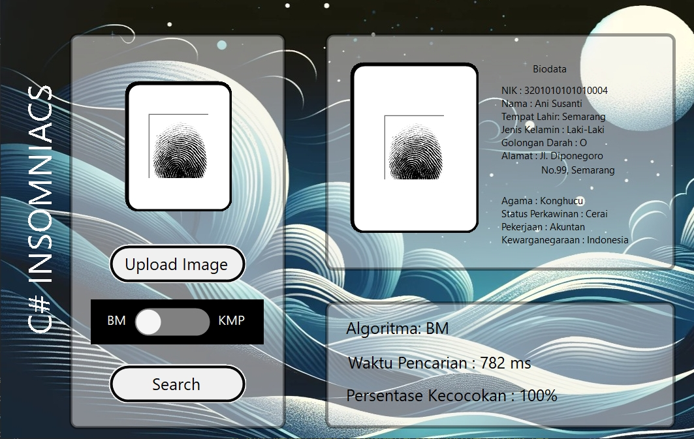
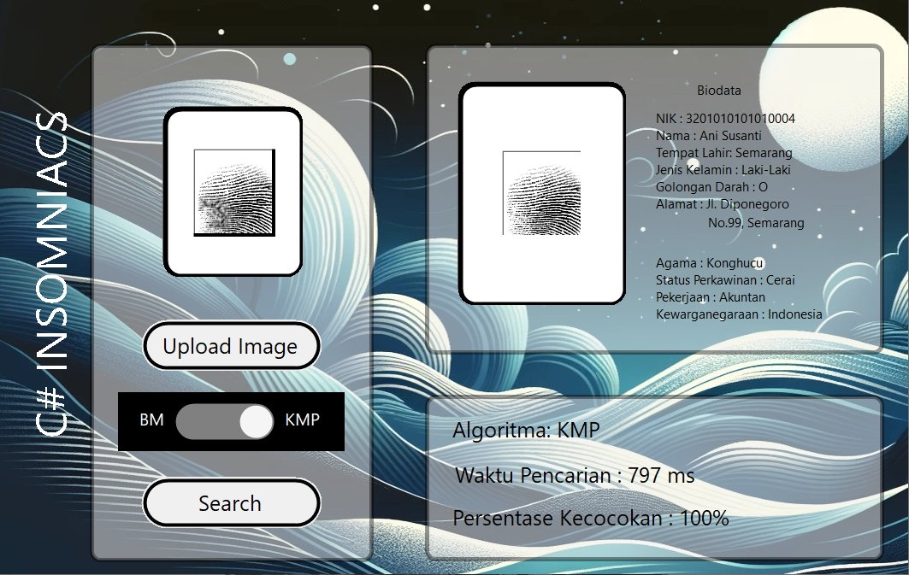

# Pemanfaatan Pattern Matching dalam Membangun Sistem Deteksi Individu Berbasis Biometrik Melalui Citra Sidik Jari
> Dibuat dalam rangka pemenuhan Tugas Besar 3 IF2211 Strategi Algoritma 

## Table of Contents
- [Pemanfaatan Pattern Matching dalam Membangun Sistem Deteksi Individu Berbasis Biometrik Melalui Citra Sidik Jari](#pemanfaatan-pattern-matching-dalam-membangun-sistem-deteksi-individu-berbasis-biometrik-melalui-citra-sidik-jari)
  - [Table of Contents](#table-of-contents)
  - [General Information](#general-information)
  - [Technologies Used](#technologies-used)
  - [Features](#features)
  - [Screenshots](#screenshots)
  - [Setup](#setup)
  - [Usage](#usage)
  - [Project Status](#project-status)
  - [Room for Improvement](#room-for-improvement)
  - [Contributors](#contributors)

## General Information
- This project aims to match a given fingerprint image with fingerprint images inside database with either _Knuth-Morris-Pratt_, _Boyer-Moore_, or _Longest-Common-Distance_ (dynamic programming approach) algorithm, and then show the biodata of the person.

## Technologies Used
- Dotnet 8.0
- Dapper
- Sqlite
- SixLabors

## Features
- Upload Fingerprint Image
- Choose Algorithm
- Search Fingerprint (with either _Knuth-Morris-Pratt_, _Boyer-Moore_, or _Longest-Common-Distance_ algorithm)
- Show Result
- Encrypted Biodata
- Regex matching

## Screenshots

## Setup

### Windows

1. Dump the sql to data.db inside src/project/backend/database directory

2. Encrypt the inserted data : From Tubes3_C-INSOMNIACS directory, navigate to "src" and then "EncryptDatabase" directory

    `cd src`

    `cd EncryptDatabase`

3. Install requirements

    `dotnet add package System.Drawing.Common`

    `dotnet add package SixLabors.ImageSharp`

    `sudo apt install dotnet-runtime-6.0`

    `dotnet add package System.Data.SqlClient`

    `dotnet add package System.Data.SQLite`

    `dotnet add package Microsoft.Data.Sqlite`

    `dotnet add package Dapper`

4. Run to encrypt the data within "biodata" table

    `dotnet run`

5. Navigate back to "src" and then "project" directory

    `cd ..`

    `cd project`

6. Install Requirements

    `dotnet add package System.Drawing.Common`

    `dotnet add package SixLabors.ImageSharp`

    `sudo apt install dotnet-runtime-6.0`

    `dotnet add package System.Data.SqlClient`

    `dotnet add package System.Data.SQLite`

    `dotnet add package Microsoft.Data.Sqlite`
    
    `dotnet add package Dapper`

7. Run program

    `dotnet run`

## Usage

1. To use this program, start by uploading the fingerprint image you want to search for by pressing the "Upload Image" button.

2. Next, adjust the toggle to select the algorithm you want to use (KMP for Knuth-Morris-Pratt and BM for Boyer-Moore).

3. Press the "Search" button to start the search process.

4. Wait a moment for the results to appear. If a fingerprint in the database has a similarity level above 55%, the result will be displayed. If the similarity level is below 55%, a _pop-up_ will appear informing you that the fingerprint is not found in the database.

## Project Status
Project is: _complete_

## Room for Improvement
- Better Algorithm
- Better GUI

## Contributors
- Yudi Kurniawan (10023634)
- Maximilian Sulistiyo (13522061)
- Marvel Pangondian (13522075)
- Steven Tjhia (13522103)